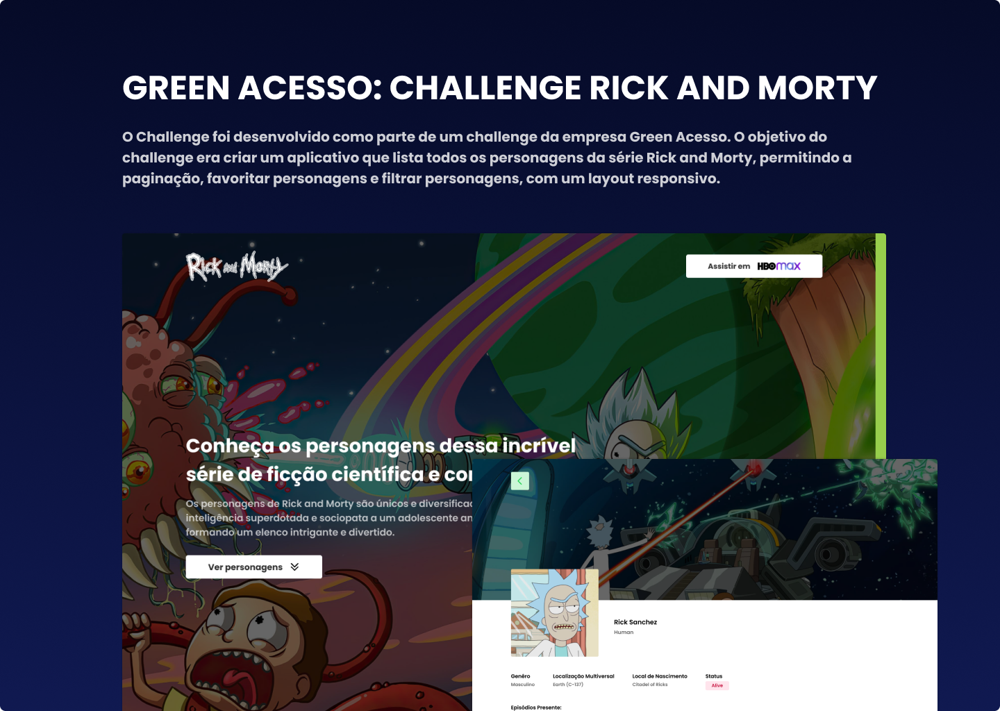

# Green Acesso - Rick and Morty Challenge

O objetivo do challenge era criar um aplicativo que lista todos os personagens da série Rick and Morty, permitindo a paginação, favoritar personagens e filtrar personagens, com um layout responsivo.

## Tecnologias Utilizadas

Neste projeto, foram utilizadas as seguintes tecnologias:

- **NextJS**: um framework para React que fornece recursos como renderização do lado do servidor, geração de páginas estáticas e dinâmicas e muito mais.
- **Axios**: uma biblioteca JavaScript que fornece uma interface simples para fazer requisições HTTP.
- **TypeScript**: um superset de JavaScript que adiciona tipagem estática à linguagem.
- **PhosphorIcons**: uma biblioteca de ícones com mais de 20.000 ícones.
- **React Query**: uma biblioteca que gerencia o estado de dados em aplicativos React, simplificando o gerenciamento de cache, atualizações e muito mais.
- **React Slick**: uma biblioteca de slider/carrossel de imagens para React.
- **Tailwind CSS**: uma biblioteca de classes CSS pré-definidas que facilita a criação de layouts responsivos e personalizados.
- **Commitlint**: uma ferramenta que ajuda a manter as mensagens de commit padronizadas em um projeto.
- **ESLint**: uma ferramenta de análise de código estático que ajuda a identificar e corrigir problemas em um código JavaScript/TypeScript.
- **Husky**: um utilitário que permite adicionar ganchos (hooks) para executar ações antes ou depois de certos eventos do Git, como commit, push, etc.
- **Jest**: um framework de teste de JavaScript com uma sintaxe simples e fácil de aprender.
- **Prettier**: uma ferramenta que formata o código automaticamente com base em um conjunto de regras definidas.
- **Commitzen**: um utilitário que fornece um conjunto de convenções para escrever mensagens de commit claras e concisas.
- **Testing Library**: uma biblioteca que fornece uma API para escrever testes de componentes React e que enfatiza a interação do usuário com a interface, em vez de testar a implementação interna.
- **Mantine Hooks (useDebouncedValue e usePagination)**: uma coleção de hooks personalizados para React que oferecem funcionalidades extras, como debounce de valores de entrada e paginização de dados, melhorando a performance e a experiência do usuário.

## Estrutura do Projeto

- `pages`: diretório com as páginas da aplicação;
- `components`: diretório com os componentes da aplicação;
- `styles`: diretório com os arquivos de estilos globais;
- `entities`: diretório com as entidades da aplicação, como modelos de dados;
- `utils`: diretório com utilidades e funções auxiliares da aplicação;
- `assets`: diretório com os arquivos estáticos da aplicação, como imagens e fontes.
- `__tests__`: diretório com os testes unitários.

## Design

O design do projeto foi criado utilizando o Figma. O link do projeto pode ser encontrado [aqui](https://www.figma.com/file/FVP6b3xMEaHplgGRX7kBIr/Green-Access---R%26M?node-id=0%3A1&t=gsBBzBaNmDje9jRm-1).

## Instalação e Uso

- Clone o repositório: `git clone https://github.com/danielbenicio/green-acesso-challenge.git`
- Acesse o diretório do projeto: `cd green-acesso-challenge`
- Instale as dependências: `pnpm install`
- Inicie o servidor de desenvolvimento: `pnpm run dev`
- Acesse a aplicação no navegador: `http://localhost:3000`

OBS: Caso não tenha o instalador de pacotes `pnpm`, utilize o comando `npm install -g pnpm`

## Como Executar os Testes

Para executar os testes unitários do projeto, utilize o seguinte comando: `pnpm test`.

## Deploy

A Vercel é uma plataforma de computação em nuvem que permite a hospedagem e o deployment (implantação) de sites e aplicativos na web de maneira rápida e fácil. A plataforma é construída com base no conceito de Jamstack, que enfatiza a separação do front-end e do back-end e o uso de ferramentas modernas de desenvolvimento web, como React, Next.js e GraphQL.

Você pode acessar o projeto clicando [aqui](https://green-acesso-challenge-self.vercel.app/).

## Contato

Email: danielbenicio123@gmail.com

Linkedin: https://www.linkedin.com/in/danielbenicio/

